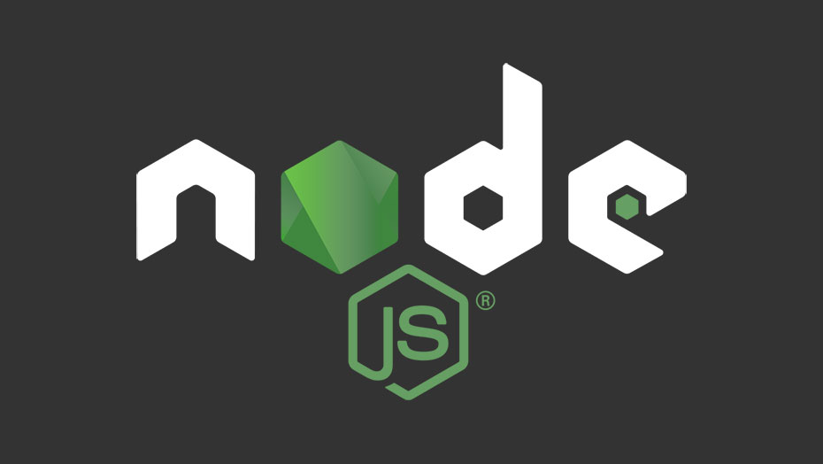

<!-- 
-->

 

### 👋Hi! I am Madhusree Bera
- 🤓 I'm currently pursuing B.Tech in Computer Science & Engineering
- 🔭 I’m currently working on website of EDGE (tech-fest of my college) as a front-end developer
- 🐍 I’m currently learning more about Typescript, Material-UI and React

 
 

&nbsp;&nbsp;

 
 
 
 
<h2> 🛠 &nbsp;My Tech Stack</h2>

 &nbsp; &nbsp; &nbsp;
&nbsp; &nbsp;&nbsp;  &nbsp;  &nbsp; &nbsp; &nbsp;

 
<h2>🐱 &nbsp;Github Information</h2>

